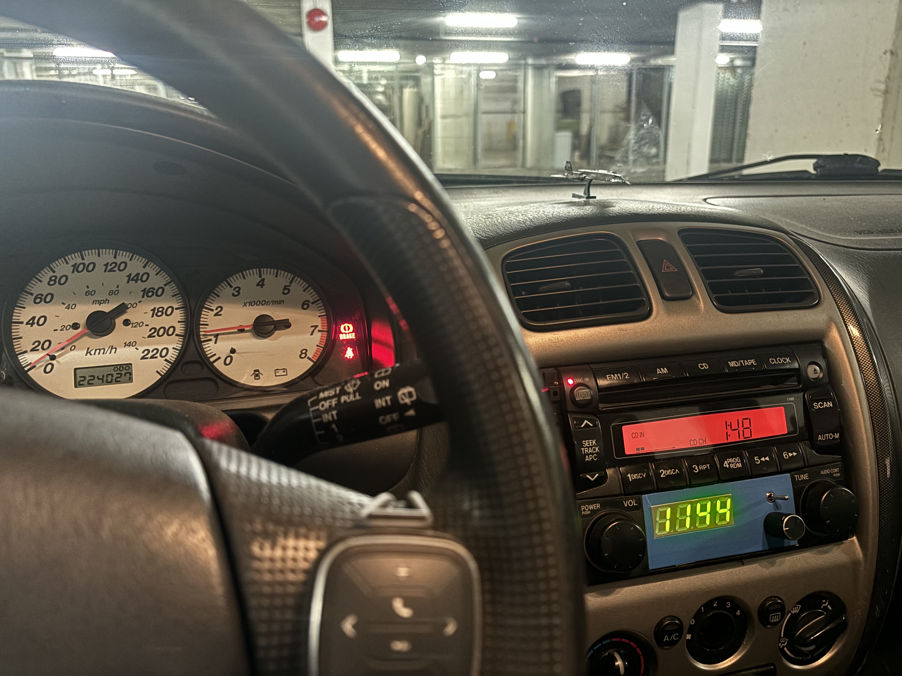
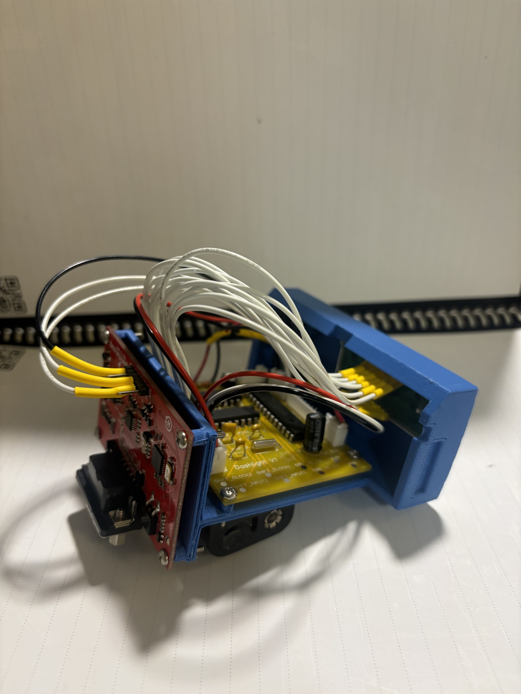

# Firmware for Dashlight Project

This repository includes files used in the design and development of firmware for the Dashlight project. Find information about the hardware side of the project at https://github.com/DuncanB6/dashlight-hardware.

Although most files and build information is available, trying to reproduce this project without modification is not advised. Differences in your car (either hardware or software) could easily cause headaches. This was built for a 2002 Mazda Protege5.

## Overview

The objective of this project is to provide a display for my car (The Yellow Peril) that displays some data while driving. 

The software supports tool for interfacing with an OBD2-UART board to gather information from the OBD port and display it on a 7 segment. There are currently 5 data fields that can be displayed:

- Time since start
- RPM
- Intake air temperature
- Speed
- MPG

Fields can be selected using a potentiometer.

## Files

main.c: Main file, contains initiations, the ISR used for the 7 segment, and the state machine where the field displayed is determined.

init_timers.c: Sets up peripherals, assigns pins

carInterface.c: Provides functions for sending, receiving, and parsing the OBD2 functions used by the Sparkfun board. Since the board is design for CLI use, the returned messages require some parsing.

rtcc.c: Functions for collecting the current time using the RTCC.

sevenSegment.c: Functions for writing digits to the 7 segment display using the shift registers. Bit bangs digits in quick succession.

## OBD Communication

The Sparkfun OBD2-UART board has several commands that can be used to initialize a connection:

atz: Initialize connection
atsp0: Discover what protocol the car uses

These commands are used on initialization. After a connection is made, standard OBD2 PIDs can be used. Find a list of them here: https://en.wikipedia.org/wiki/OBD-II_PIDs

## Build

This software was developed using MPLABX and flashed/debugged using and MPLAB Snap. The most recent build is available in this project.

